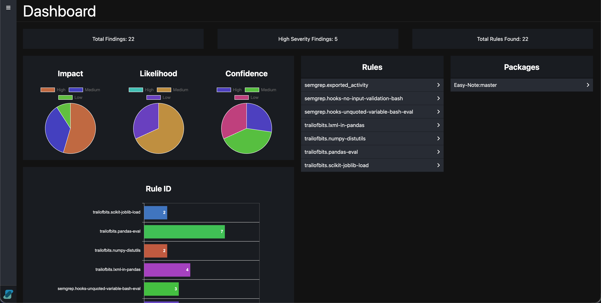
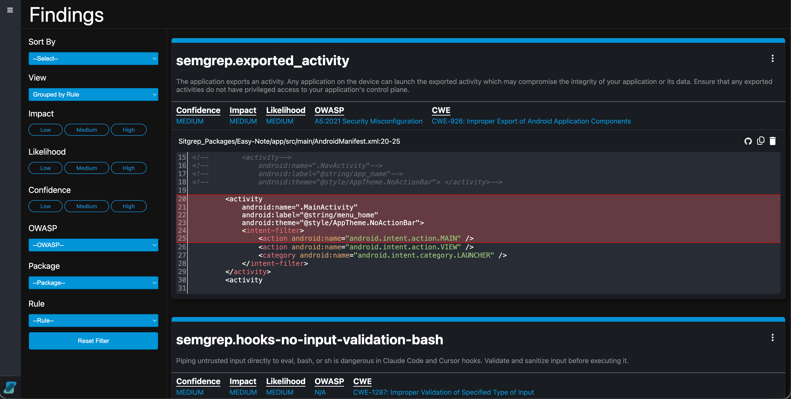

Sitgrep is a wrapper for [Semgrep](https://github.com/semgrep/semgrep) that makes it quick and easy to scan code for insecure coding practices and hard-coded secrets.

Sitgrep offers an intuitive solution for scanning GitHub and GitLab repositories. By simply providing a link to any repository, Sitgrep will automatically download and perform a thorough scan, streamlining the process for reviewing code for security issues. It then generates a results pag, which gets automatically opened, allowing you to review findings quicker and export results for your client, saving you precious time while on your engagement. Additionally, this can be used locally without sending metrics which makes it viable for scanning proprietary code that is not public, making it perfect for when clients are a bit reluctant to run a static analysis tool on their code base.





# Installation

## Linux/WSL and MacOS

1. Download the latest release from the releases page
2. Unzip the project and navigate to it in the terminal.
3. Run the install script: 
   ```
    python3 install.py
    ```
4. Run the rule fetcher to download rules locally:
    ```
    sitgrep fetch
    ```

## Docker

The Docker usage is only meant for instances where Sitgrep cannot run natively in a UNIX enviroment like Linux/WSL or MacOS. As such, it is limited to default scan settings without being able to supply any CLI arguments. 

1. Download the latest release from the releases page
2. Unzip the project and navigate to it in the terminal.
3. Run the following command to build the Docker image:
    ```
    docker build -t sitgrep .
    ```
4. Set the following environment variable to the folder containing the code to scan:
    ```
    HOST_DIRECTORY=/home/User/path/to/code
    ```
5. Run the following docker command to start the container (you can alias this for future use):
    ```
    docker run -p 127.0.0.1:9000:9000 -e HOST_DIRECTORY="${HOST_DIRECTORY}" -v "${HOST_DIRECTORY}:/target/" sitgrep
    ```
6. Go to 127.0.0.1:9000 in the web browser to access the web UI.
7. Confirm that the directory to scan is correct and click the `Scan` button.
8. The scan will begin and run inside the docker container. Once complete, a ZIP folder with the results will automtically be downloaded.

# Uninstall
If you want to uninstall, simply run the following command:

```
python3 -m pip uninstall sitgrep
```

# Usage
```
sitgrep {local} [options] 

Example: sitgrep -c 2 -d ~/my/dir/ -o output_file 

positional arguments:
  local                           Enable local mode
    -N, --no-scan                 Only download the packages, do not scan them. (default=False)
    -gh, --github       Provide a list of Github repositories to download and scan. Overrides the directory parameter (-d)
    -gh, --github       Provide a list of Gitlab repositories to download and scan. Overrides the directory parameter (-d)
    -vs, --vscode       Open the folder being scanned in VSCode after scan finishes. Only usable when not using --github/--gitlab


optional arguments:
  -h, --help          Show this help message and exit
  -c, --context       The amount of context lines above and below to save (default=5)
  -d, --directory     The directory to scan (default=CWD)
  -o, --output        The output file name (default=SitgrepResults.html)
  -V, --version       Print Sitgrep's version   
  -v, --verbose       Increase verbosity level (default 0, max of 3)
  -j, --json-input    Load a Semgrep JSON output file
  -n, --no-auto-open Disable auto-opening the results in the browser
  -gh, --github       Provide a list of Github repositories to download and scan. Overrides the directory parameter (-d)
  -gh, --github       Provide a list of Gitlab repositories to download and scan. Overrides the directory parameter (-d)
  -vs, --vscode       Open the folder being scanned in VSCode after scan finishes. Only usable when not using --github or --gitlab
```

1. Run the command `sitgrep` in the terminal with any additional arguments as needed.
2. Go to the `sitgrep-results` folder that the tool automatically makes. 
3. Open the HTML page that Sitgrep generates.
4. Verify all findings. Results should not be taken at face-value.
5. In the HTML page created by Sitgrep, delete any false-positives.
6. Optional: Export triaged results in JSON format
    * Exporting exports all findings that are not deleted. Findings that are hidden by the filter are also included.

# Github Packages

``--github/-gh`` and ``--gitlab/-gl`` can be used for Github packages in both ``local`` mode and normal mode.

# Local Mode

`sitgrep local` uses local rules, sourced from Semgrep's [open source rules Github](https://github.com/semgrep/semgrep-rules).

`sitgrep local --github` downloads the packages, listed in a text file or in the command line:

```sitgrep local --github list.txt ```

or

```sitgrep local --github Package1,Package2 ```

Note: `--github` overrides the `-d/--directory` parameter


### How to create list.txt?
The `--github/--gitlab` parameter looks for a text file or a list of Github/Gitlab URLs. 

### Don't want to scan? Only want to download the repositories?

No problem! Use the `-N/--no-scan` flag to only download the repositories without scanning them.


# Troubleshooting
Oh no, I am have issues installing or running Sitgrep! What's wrong!?

Here are some possible issues:

* Install works, Sitgrep command not found:

  * Check if your PATH includes where Sitgrep is installed. To check, either rerun the installer and look for a WARNING message, or run `pip/pip3 show sitgrep`. If your PATH does not include the install location, you will need to update your PATH to include the install location

* Install works, Sitgrep returns with errors:

  * A case with Semgrep using too much memory can cause Sitgrep to fail. The cause of this is due to using a generic rules having excessively broad pattern matching using the `generic` language type. The solution is to specify the exact supported languages.

  * Sometimes Semgrep itself will return segfaults. It will look like `<Signals.SIGSEGV: 11>`. A solution to this is simply removing Semgrep and reinstalling. You can use the installer, the requirements.txt, or manually reinstall Semgrep. 


For any issues that aren't resolved by these potential fixes, please open an issue on Sitgrep's Github page.

# Contributing
If contributing Semgrep rules, please use Semgrep's rule playground to write and test the rules before submitting them to Sitgrep.

## Adding Your Own Rules
If you want to add your own rules, put them in the `.sitgrep/rules/local/` folder

# Authors and acknowledgment
- Original author and current maintainer: [John Ascher](https://github.com/S0meday)
- Semgrep engine: [Semgrep](https://github.com/semgrep/)
- Semgrep rules: [Semgrep rules registry](https://github.com/semgrep/semgrep-rules) by Semgrep

